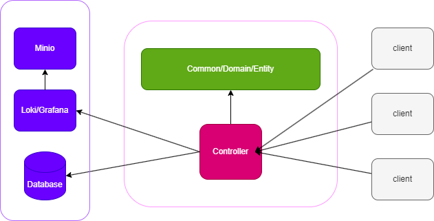

# serverx
A server template combines multiple basic tools

## Atchitecture


## Integration
- Router: Gin
- Config: Viper
- ORM: Gorm
- Logging: Zerolog
- Cmd: Cobra
- Error trace: erx
- Rest api doc: swaggo/swag
- Logger: Loki x grafana
- Session: JWT
- Validator: go-playground/validator
- DB:
    - Postgres
    - Sqlite
    - Mysql
- Benchmark: K6
- format
  - https://github.com/mvdan/gofumpt
- Long line format
  - https://github.com/segmentio/golines

## How to use this project
1. Clone the repository
2. Change the module name to yours
3. Run service(default use stdout logging)
```bash
go run . server
```

## Convention
```sh
# Check conventions, can integrate into CICD
python3 scripts/convention/check.py
```
- **camelCase**: file name, folder name
- **PascalCase**: json attribute name, db table name, db column name
- Lines must be less than 99 characters, but its soft limit
- Never use **init()**, except for 3rd-party specify
- Never use fmt.Prinxxx, use log.Debug() instead

## Dev environment
- Linux
- Code first (not data first)
- Docker

## Directory structure
- <span style="color: pink;">api</span>: API route definition
- <span style="color: pink;">cmd</span>: Command entry point
- <span style="color: pink;">tests</span>: Benchmark and api test with k6
- <span style="color: pink;">docs</span>: Documentation
  - <span style="color: pink;">openapi</span>: Document generated from swaggo
- <span style="color: pink;">internal</span>: Go function to not export the main logic
  - <span style="color: pink;">boot</span>: Initialization processes
  - <span style="color: pink;">common</span>: Shared utility functions
  - <span style="color: pink;">controller</span>: The main handler to process business logic
  - <span style="color: pink;">gen</span>: Code generated by gormx
  - <span style="color: pink;">global</span>: Global variables and instances
    - <span style="color: pink;">domain</span>: General domain-level entities like error codes
  - <span style="color: pink;">job</span>: Periodic or cron job executables
  - <span style="color: pink;">model</span>: GORM models
  - <span style="color: pink;">service</span>: Service layer logic
    - <span style="color: pink;">exter</span>: External services (e.g., Redis, Loki, database)
    - <span style="color: pink;">inter</span>: Internal services (e.g., validators, schedulers)
- <span style="color: pink;">manifest</span>:
  - <span style="color: pink;">deploy</span>: Deployment-related files
- <span style="color: pink;">scripts</span>:
  - <span style="color: pink;">convention</span>: Convention-checking scripts